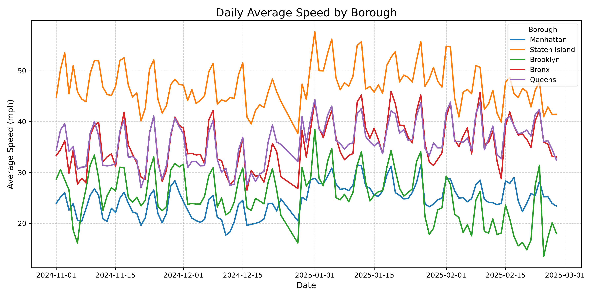
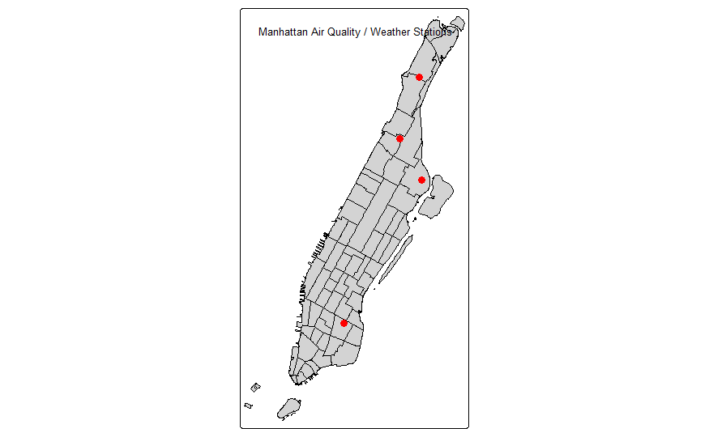
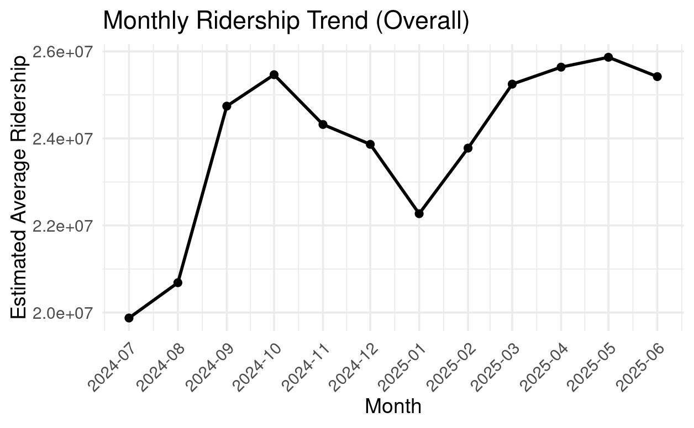
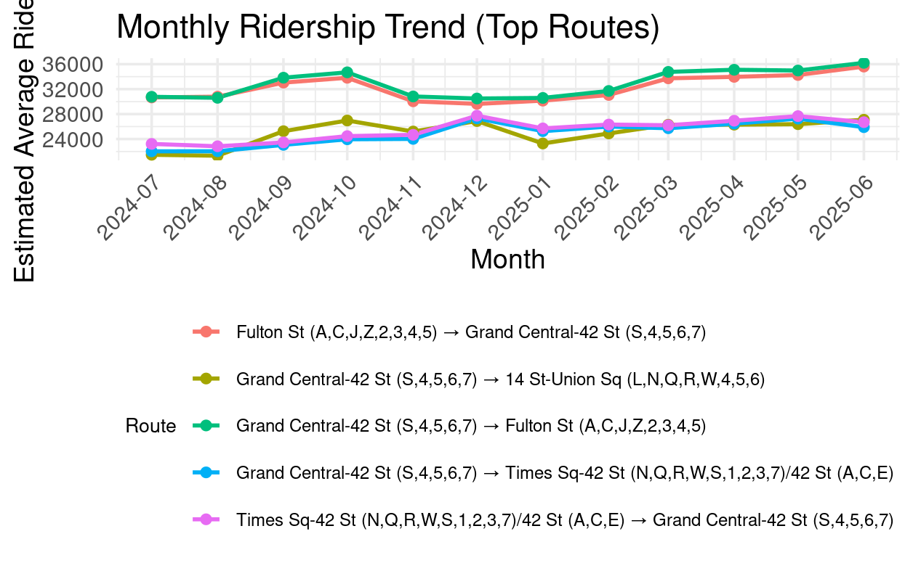

```{r setup, include=FALSE}
knitr::opts_chunk$set(echo = TRUE, message = FALSE, warning = FALSE)
```

# (Car Speed) Data Description

-   Author:
-   Date first created:
-   Background:
-   Unit of observation:
-   Sample period:
-   Known issues:
-   Definition for each variable:
    -   Date :
    -   Manhattan / Staten Island / Brooklyn / Bronx / Queens : Average car speed in each region.

### Sample

```{python}
f = "NYC_daytime_avg_by_borough.csv"
df = pd.read_csv(f, encoding_errors="ignore")
print(df.head())
```

| DATE       | Manhattan | Staten Island | Brooklyn  | Bronx     | Queens    |
|------------|-----------|---------------|-----------|-----------|-----------|
| 2024-11-01 | 23.978043 | 44.784306     | 28.727778 | 33.329835 | 34.384699 |
| 2024-11-02 | 25.155049 | 50.309235     | 30.587389 | 34.491902 | 38.388292 |
| 2024-11-03 | 26.003975 | 53.526636     | 28.574331 | 36.234852 | 39.585172 |
| 2024-11-04 | 22.608314 | 45.481213     | 26.580278 | 29.877585 | 34.197061 |
| 2024-11-05 | 23.903571 | 51.046294     | 18.641286 | 34.396597 | 35.079490 |

Plotting the time-series average speed from different boroughs:



# (Pollution) Data Description

-   Author:
-   Date first created:
-   Background:
-   Unit of observation:
-   Sample period:
-   Known issues:
-   Definition for each variable:

### Sample



The below rows show the **Date**, **Average AQI**, and **Average PM2.5 concentration** from 2024/01/01 to 2025/03/26:

| Date       | PM2.5 | AQI |
|------------|-------|-----|
| 01/01/2024 | 8.6   | 48  |
| 01/04/2024 | 7.1   | 39  |
| 01/07/2024 | 3.2   | 18  |
| 01/10/2024 | 3.2   | 18  |
| 01/13/2024 | 4.4   | 24  |
| 01/16/2024 | 7.8   | 43  |

# (MTA) Data Description

-   Author: ChengYu, Lee
-   Date first created: 20251026
-   Background: The dataset contains information about subway ridership between different stations in New York City, including the date, day of the week, geographical coordinates of the stations and the ridership.
-   Unit of observation: Passenger per hour between origin and destination subway stations.
-   Sample period: Jul, 2024 to Jun, 2025
-   Known issues: None.
-   Definition for each variable:
    -   Year – The year in which the subway trips occurred.
    -   Month – The month in which the subway trips occurred.
    -   Day.of.Week – The day of the week on which the subway trips occurred (Monday, Tuesday, etc.).
    -   Hour.of.Day – The hour of the day in which the subway trips occurred. All trip times are rounded down to the nearest hour.
    -   Timestamp – Representative datetime for the year, month, day of week, and hour of day in which the subway trips occurred. This date will be from the first full week of the month.
    -   Origin.Station.Complex.ID – The unique identifier for the subway station complex where the trips originated.
    -   Origin.Station.Complex.Name – The name of the subway station complex where the trips originated.
    -   Origin.Latitude – The latitude of the subway station complex where the trips originated.
    -   Origin.Longitude – The longitude of the subway station complex where the trips originated.
    -   Destination.Station.Complex.ID – The unique identifier for the subway station complex where the trips are inferred to have ended.
    -   Destination.Station.Complex.Name – The name of the subway station complex where the trips are inferred to have ended.
    -   Destination.Latitude – The latitude of the subway station complex where the trips are inferred to have ended.
    -   Destination.Longitude – The longitude of the subway station complex where the trips are inferred to have ended.
    -   Estimated.Average.Ridership – The estimated ridership for an origin-destination pair and hour of day, averaged by day of week over the calendar month.
    -   Origin.Point - A concatenation of Origin.Latitude and Origin.Longitude.
    -   Destination.Point - A concatenation of Destination.Latitude and Destination.Longitude.

```{r}
library(dplyr)
library(readr)
library(tidyr)
library(ggplot2)
```

### Sample

Note: As the original dataset is too large to be uploaded to GitHub, we provide here a small sample of the data for illustration purposes only. The full dataset can be accessed at [link to full dataset].

```{r}
ds_head <- read.csv("../raw/MTA_df_head.csv")
ds_head
```




