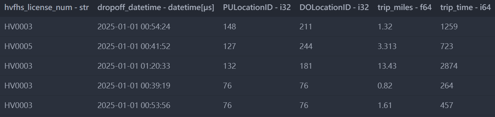
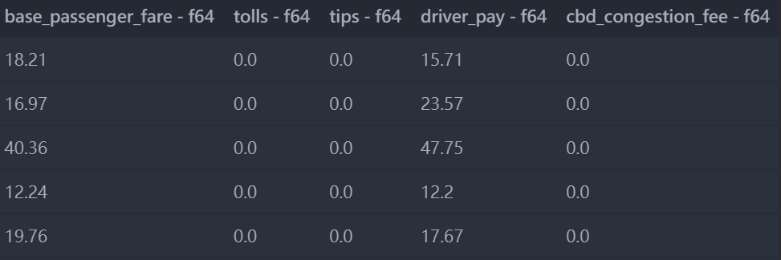
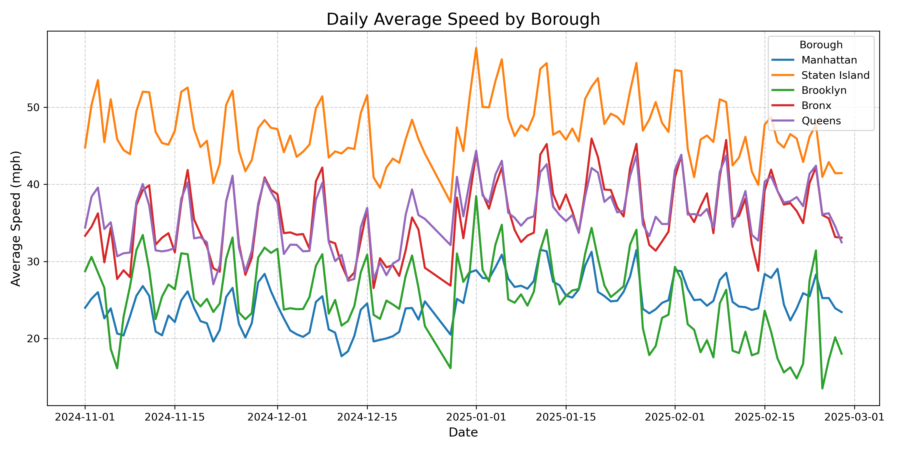
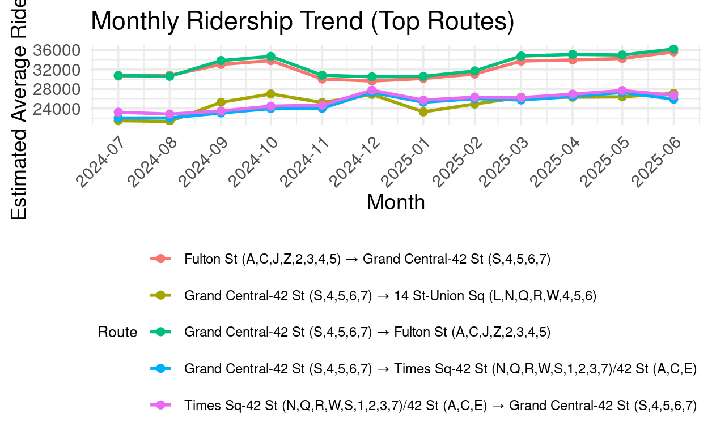

# Group 3 Summary statistics presentation

## HVFHV data 

In our main dataset (High Volume For-Hired Vehicles), in each row we have the type of the car, the travel datetime, travel starting and ending districts, different kinds of fees... etc as shown.


(countinued)


## Car Speed in different boroughs

In the data from the New York City, we can filter by region to compare car speeds change across time. The first five rows:

```python
file = "NYC_daytime_avg_by_borough.csv"
df = pd.read_csv(file, encoding_errors="ignore")
print(df.head())
```

| DATE       | Manhattan | Staten Island | Brooklyn  | Bronx     | Queens    |
|------------|-----------|---------------|-----------|-----------|-----------|
| 2024-11-01 | 23.978043 | 44.784306     | 28.727778 | 33.329835 | 34.384699 |
| 2024-11-02 | 25.155049 | 50.309235     | 30.587389 | 34.491902 | 38.388292 |
| 2024-11-03 | 26.003975 | 53.526636     | 28.574331 | 36.234852 | 39.585172 |
| 2024-11-04 | 22.608314 | 45.481213     | 26.580278 | 29.877585 | 34.197061 |
| 2024-11-05 | 23.903571 | 51.046294     | 18.641286 | 34.396597 | 35.079490 |


Plotting the time-series average speed from different boroughs:



## Pollution data in Downtown Manhattan 

We combined the **shp data** (geometric data) and the data of **pollution monitoring sites**. The red dots indicate the positions of the stations, while the background is the new york city shp, filtered by Manhattan.


The below rows show the **Date**, **Average AQI**, and **Average PM2.5 concentration** from 2024/01/01 to 2025/03/26:

| Date       | PM2.5 | AQI |
|-------------|-------|-----|
| 01/01/2024 | 8.6   | 48  |
| 01/04/2024 | 7.1   | 39  |
| 01/07/2024 | 3.2   | 18  |
| 01/10/2024 | 3.2   | 18  |
| 01/13/2024 | 4.4   | 24  |
| 01/16/2024 | 7.8   | 43  |

## MTA (Metropolitian Transportation Authority) Data

```
ds_head <- read.csv('C:/114-1_Autumn/Data_science_and_social_inquiry/to_github/fa-25-econ-5166-group-3/data/raw/MTA_df_head.csv')

ds_head
```

| X | Year | Month | Day.of.Week | Hour.of.Day | Origin.Station.Complex.Name | Origin.Latitude | Origin.Longitude | Destination.Station.Complex.Name | Destination.Latitude | Destination.Longitude | Estimated.Average.Ridership |
|---|------|--------|--------------|--------------|-----------------------------|-----------------|------------------|----------------------------------|----------------------|-----------------------|-----------------------------|
| 1 | 2024 | 8 | Thursday | 0  | Grand St (B,D) | 40.71827 | -73.99375 | 74-Broadway (7)/Jackson Hts-Roosevelt Av (E,F,M,R) | 40.74675 | -73.89137 | 1.4608 |
| 2 | 2024 | 8 | Monday   | 16 | Queens Plaza (E,M,R) | 40.74897 | -73.93724 | 4 Av (F,G)/9 St (R) | 40.67056 | -73.98904 | 1.1940 |
| 3 | 2024 | 8 | Thursday | 0  | 79 St (1) | 40.78393 | -73.97992 | 74-Broadway (7)/Jackson Hts-Roosevelt Av (E,F,M,R) | 40.74675 | -73.89137 | 1.0044 |
| 4 | 2024 | 8 | Monday   | 16 | Wall St (2,3) | 40.70682 | -74.00910 | Delancey St (F)/Essex St (J,M,Z) | 40.71846 | -73.98778 | 0.8257 |
| 5 | 2024 | 8 | Thursday | 0  | 225 St (2,5) | 40.88802 | -73.86034 | Times Sq-42 St (N,Q,R,W,S,1,2,3,7)/42 St (A,C,E) | 40.75575 | -73.98758 | 3.7166 |


